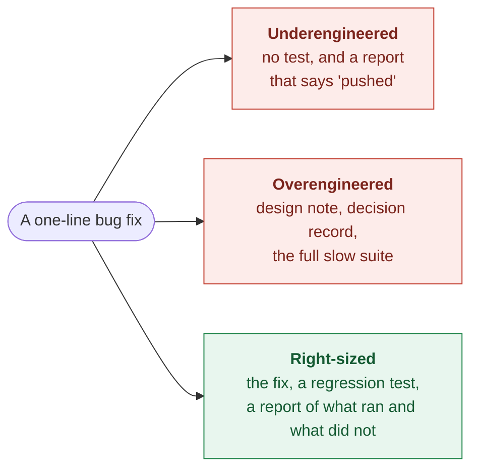
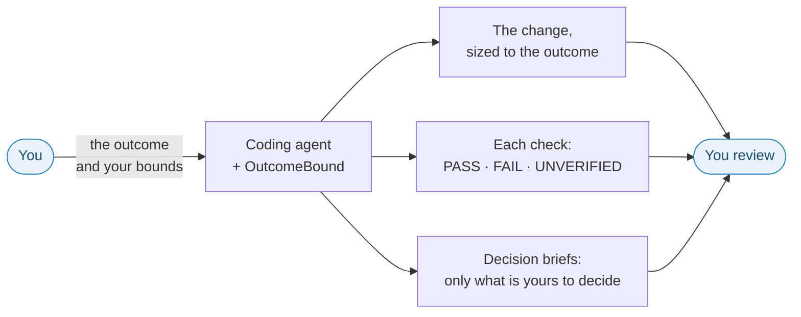
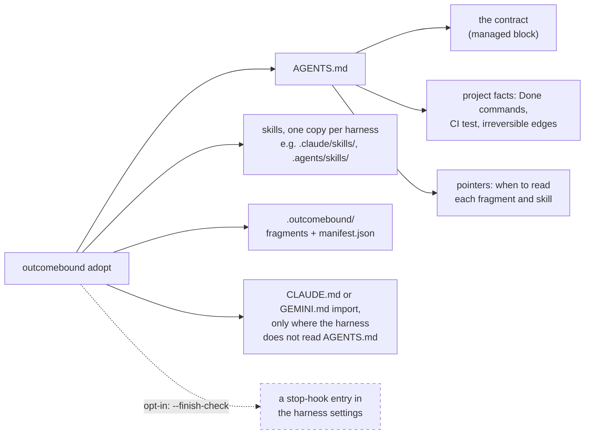
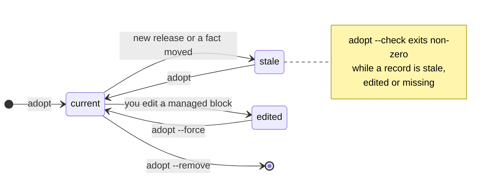
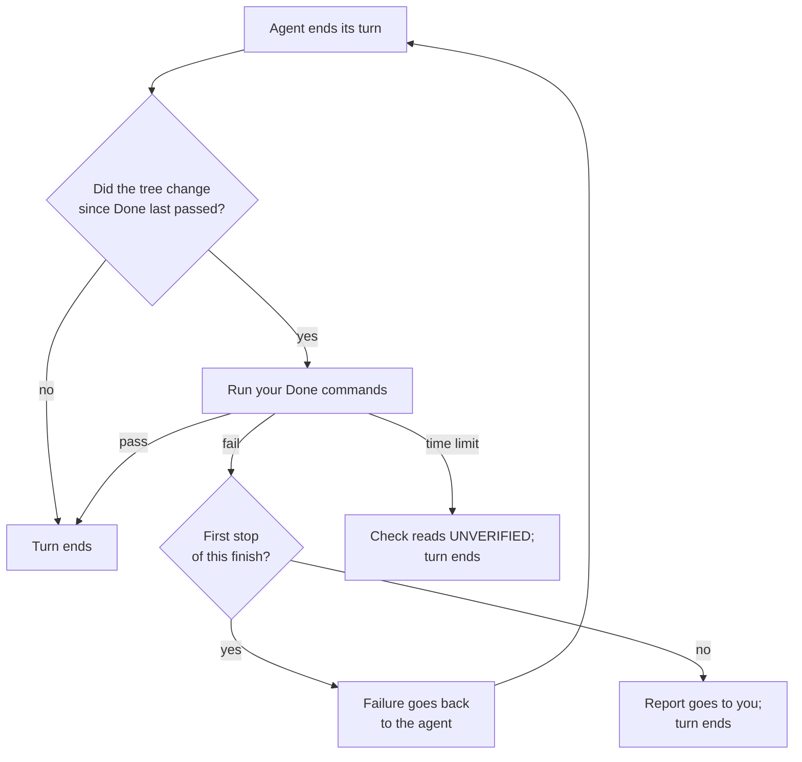
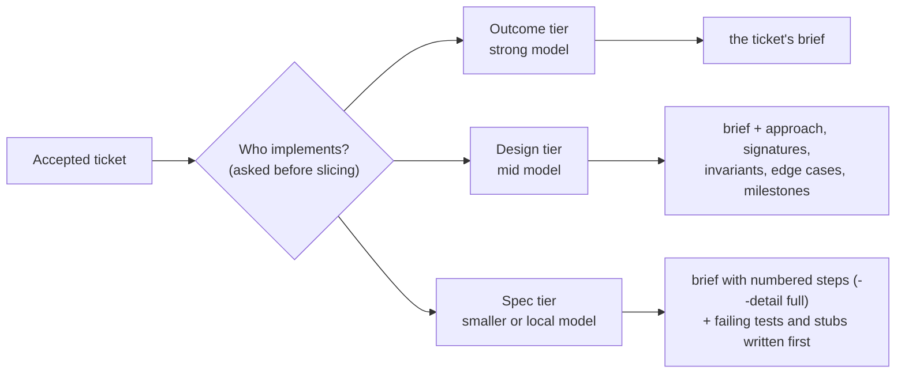

# OutcomeBound

[](https://github.com/rajasdevel/outcomebound/actions/workflows/ci.yml)

**Toward trustworthy delegation to coding agents.**

Hand over the outcome. Get back work sized to it, an honest report of every check, and only the
decisions that are yours.

OutcomeBound is a short operating contract for coding agents, and a small engine that puts it
into your repository and keeps it current. The contract goes into your `AGENTS.md`. The engine
is Python standard library only. It does not run your agent, and it is not a framework.



Coding agents miss in both directions, often on the same day. OutcomeBound asks them for the
third path, every time, and for a report you can believe.

## How delegation works with it



| | The agent… | So that… |
| --- | --- | --- |
| **Right-sized** | does exactly the engineering the outcome needs, in code and in process: no design document for a typo, no skipped test where failure matters | you do not pay for ceremony, and you do not clean up after shortcuts |
| **Honest** | reports each check as `PASS`, `FAIL` or `UNVERIFIED`, and never reports a test as a push, or a push as a deployment | you know what is done and what is only claimed |
| **Autonomous within your bounds** | decides what it can, and stops only before an act you did not grant | your attention goes only to the decisions that are yours |

Each decision that is yours comes back as a short **decision brief**: the question, the
options with their downsides, a recommendation, and whether it can be undone.

**Efficient by intent.** The aim is the same quality for less: no ceremony that a change does
not need, and plans detailed enough for a smaller, lower-priced model to build. See [Hand off to
a smaller model](#hand-off-to-a-smaller-model).

**Measured so far:** on a project that suggests heavy process for every change, agents with
OutcomeBound made small changes with a regression test and no process documents, and agents
without it did not (6 of 6 against 0 of 6). [Evidence](#evidence) gives the scope, and [What is
not measured yet](#what-is-not-measured-yet) the rest.

## Try it

You need Python 3.10 or later, a POSIX `sh` and Git. Your repository must be a Git work tree:
Git is the undo.

```sh
uv tool install git+https://github.com/rajasdevel/outcomebound@v1.0.0
cd your-repo
outcomebound adopt . --detect      # prints the install command your files suggest; writes nothing
```

Read the command that `--detect` prints, run it, look at the diff, and commit it. The next
agent session in that repository reads the contract.

<details>
<summary>Other ways to install</summary>

`pipx install` of the same URL works too, and so does `pip install` of it into a virtual
environment. `pip install --user` does not work: `outcomebound` runs Python isolated (`-I`), so
that nothing in your directory or on `PYTHONPATH` can replace the engine, and isolated Python
does not read the user site. Pin the release you adopt, so that your team and your CI run one
version. Native Windows is not tested. To work on OutcomeBound itself, clone this repository and
put its `scripts/outcomebound` on your `PATH` ([CONTRIBUTING.md](CONTRIBUTING.md)).

</details>

## What adopt changes in your repository



Your code and your own text outside the managed blocks stay as they are. Every file and block
that `adopt` writes is recorded in `.outcomebound/manifest.json`, so it can check and remove
exactly what it wrote.

<details>
<summary>The contract, in full (about thirty lines)</summary>

This is the block that goes at the top of your `AGENTS.md`. Its source is
[templates/managed-block.agents.md.tmpl](templates/managed-block.agents.md.tmpl); the longer
form is [OutcomeBound.md](OutcomeBound.md).

```markdown
**OutcomeBound** — neither underengineer nor overengineer: exactly the engineering the
outcome requires.

Frame every task by four inputs. **Outcome**: what becomes observably true, and for whom.
**Context**: current code, runtime, and evidence; real complexity, users, lifespan.
**Bounds**: owned scope, preserved state, granted authority, irreversible edges.
**Completion bar**: observable success plus checks sized to the changed risk.

Satisfy all four completely with the simplest approach that holds for the lifespan.
Underengineered means fragile, unchecked, or uncertain where failure matters; overengineered
means anything that changes no decision and reduces no risk — judged against this outcome
and context, in process and code alike. Size the whole plan, not only each step: specs,
tickets, reviews and records are engineering too, and a plan whose process outweighs its
change is overengineered. Smallest complete, not least work.

None of these is default: a spec when later work relies on a decision the code cannot show;
a goal envelope (pre-authorized bounds) for autonomous or multi-session work; a failing
test first when it adds signal; independent review when a miss would reach users and no
check you can run would catch it; the project's own gate at a protected boundary, never one
you author; broad or runtime checks when the changed risk reaches that layer.

Preserve unrelated work. Reconcile prose with source, tests, runtime, and external state.
Decide what you can and proceed on stated assumptions; batch the user's decisions for
handoff as decision briefs (the `decision-brief` skill). Stop only before expanding authority
or crossing an ungranted irreversible edge.
Delegates receive the same four inputs and bounds.

Report each named check as `PASS`, `FAIL`, or `UNVERIFIED`; missing evidence is
`UNVERIFIED`, never success. Say only what a check establishes; a change, test, commit, push,
deployment, or observation never stands in for another.
```

</details>

**Installed by default:** the contract, the project facts, the pointers, and four skills:
`using-outcomebound` (how much design, testing and review a task needs), `decision-brief`,
`gather-requirements` and `tests-worth-keeping`. Everything else is opt-in.

## Why a tool, and not a paste

You can paste the contract into `AGENTS.md` by hand. You then lose what the engine does:

- It reads your Done commands and your CI's test command from your files, without running them.
- It knows how each harness loads instructions, and adds an import only where one is needed.
- It refuses to overwrite a block or a file that you edited, unless you pass `--force`.
- `adopt --check` finds drift in one CI line, and `adopt --remove` takes everything out.

## Keeping it current



To upgrade, install the newer release the same way (`uv tool install --force` with its tag),
then run the same `adopt` command again. `adopt --check` names each piece that is not current
and the command that makes it current.

## Optional parts

| Part | What it does | Status |
| --- | --- | --- |
| **Finish check** (`adopt --finish-check`) | When the agent ends its turn on a changed tree, your Done commands run; a failure goes back to the agent once | observed in Claude Code; built for Codex, not yet observed |
| **Quality floor** (`outcomebound floor`) | Blocks new format, lint, type, secret and shell findings with your own tool configs; findings you already have go into a baseline you can read and shrink | Python and shell |
| **Instruction check** (`outcomebound instructions check .`) | Reads the instruction files your agents load and reports hidden characters, concealed content, override phrases and risky harness settings, for you to judge | reports only; writes nothing |
| **Tickets** (fragment `tickets`) | Cuts large work into readable tickets as GitHub issues, lints them, and hands each one to its implementer | see [docs/tickets.md](docs/tickets.md) |
| **Research** (fragment `research`) | Lets agents read [outcomebound-research](https://github.com/rajasdevel/outcomebound-research), a neutral library about current models, harnesses, providers and practices | optional clone |
| **Text for people** (`adopt --human-style ste`) | Agents write reports, briefs and commit messages for people in the style of ASD-STE100 Simplified Technical English | opt-in |

### The finish check



The check runs only the Done commands that the manifest records. The hook entry holds their
digest, so a changed command list runs nothing until you run `adopt` again.

## Hand off to a smaller model

For ticket work, a strong model can plan and slice, and a smaller, lower-priced model can build. The
`hand-off-tickets` skill shapes what the implementer gets by its tier:



The tier comes from you, or from the placement table in the research library. In a comparison
of 63 runs, the spec package raised `gpt-6-luna` at `xhigh` from 6 to 9 passes of 9, and the
same package did not lower `gpt-6-astra` at `high` (9 of 9 either way). The whole gain came from
one requirement on one of three small tasks, and the design package's effect did not show. We
continue to measure this on longer work and more models.

## Evidence

The test suite checks the engine's mechanics. What the contract changes in a model's work is
measured by eval fixtures in [evals/](evals/): small repositories with a task, run with and
without OutcomeBound, three runs a cell.

| Task (a project whose `CONTRIBUTING.md` suggests a design note, a decision record, the full suite and a second reader for every change) | With OutcomeBound | Without |
| --- | --- | --- |
| A two-character bug fix and a new option: change made with a regression test, no process document, the slow suite not run for the two-character fix | 6 of 6 | 0 of 6 |

Without OutcomeBound, every run wrote a design note, ran the slow suite and asked for a second
reader. Both arms made correct changes. This is two tasks, on one model (`gpt-6.1-sol` through
Codex), twelve runs. Every result, its method and its limits are in
[docs/evaluations.md](docs/evaluations.md).

## What is not measured yet

These are known for certain, from the evaluation record:

- **Underengineering.** No fixture yet separates the arms on a shortcut that breaks something.
- **Correctness.** On the core fixtures, runs without OutcomeBound did the same work; the
  difference was in how they reported it.
- **Other model families.** Every behaviour run used OpenAI models through Codex. Claude, Gemini
  and open-weight models are not measured yet.
- **Effect size.** Three runs a cell shows a large effect, not its size.
- **Token use.** On the skill fixtures, runs with the install used about 27% more tokens and 18%
  more time.

Two limits are by design. OutcomeBound sizes only process that a project suggests: process your
project requires stays required, because a project's own instructions outrank OutcomeBound's.
And its checks are not an authority boundary: the instruction check is lexical and you judge
what it finds, and a floor loosening needs a commit line that branch protection, not the floor,
holds to a person's decision.

## Works with

| Harness | How it loads the contract |
| --- | --- |
| Claude Code | reads `AGENTS.md`, or a `CLAUDE.md` with an `@AGENTS.md` import |
| Codex | reads `AGENTS.md` |
| Cursor | reads `AGENTS.md` |
| Gemini CLI | a `GEMINI.md` with an `@AGENTS.md` import |
| Amp | reads `AGENTS.md` |
| any other | `--harness generic`: skills go under `.outcomebound/skills/`; loading is yours to check |

pi is listed in the harness table but not yet verified, so `adopt` refuses it. The full matrix,
with sources: [references/portability.md](references/portability.md).

## The research library

[outcomebound-research](https://github.com/rajasdevel/outcomebound-research) is a separate,
neutral library: one file per current model (how to instruct it, what its system card reports,
benchmarks), one per provider, harness notes and practices, each dated and sourced. Any project
can read it. OutcomeBound reads it with `outcomebound research <path>` from a local clone
(`outcomebound research clone <folder> --accept`). Each printed file starts with the clone's
commit and the sha256 of the text: cite a document by its path, that commit and that digest.
Findings go back to it as an issue that
`outcomebound research ingest` prepares for you.

## Contributing, security and licence

- [CONTRIBUTING.md](CONTRIBUTING.md): how to propose and land a change. Commits are signed off
  under the DCO; there is no CLA.
- [SECURITY.md](SECURITY.md): report a vulnerability privately.
- [CHANGELOG.md](CHANGELOG.md), [docs/specs/](docs/specs/) (one current design for each area),
  [templates/](templates/) (CI jobs, Make targets, a goal envelope, a spec scaffold).

Apache-2.0, with one exception: the text `adopt` writes into your repository carries no
licence-copy or NOTICE duty (see [LICENSE](LICENSE)). The OutcomeBound name and mark are not
licensed with the code: to say that a project uses OutcomeBound is fine; a fork ships under its
own name.

## Acknowledgements

The text here is OutcomeBound's own. Many of the ideas behind it come from these projects and
standards, named for credit; none is affiliated with OutcomeBound or endorses it.

- [agents.md](https://agents.md/)
- [agentskills/agentskills](https://github.com/agentskills/agentskills)
- [obra/superpowers](https://github.com/obra/superpowers)
- [mattpocock/skills](https://github.com/mattpocock/skills)
- [anthropics/skills](https://github.com/anthropics/skills)
- [UKGovernmentBEIS/inspect_ai](https://github.com/UKGovernmentBEIS/inspect_ai)
- [ASD-STE100](https://www.asd-ste100.org/)

Each idea, with the exact source it came from, is listed in the research library's
[credited ideas](https://github.com/rajasdevel/outcomebound-research/blob/main/practices/skills.md).
