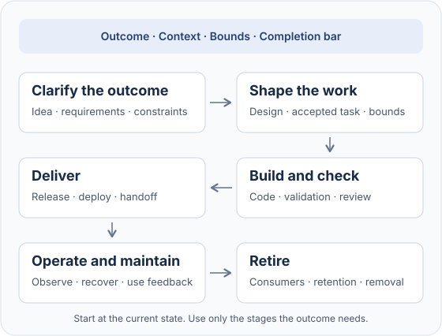

# OutcomeBound

[](https://github.com/rajasdevel/outcomebound/actions/workflows/ci.yml)

**Work sized to the outcome. Evidence for each step.**

A coding task can need more than a patch: an accepted requirement, a deployment check, or a
handoff to the next owner. A small fix can need much less. OutcomeBound helps your coding agent
carry the outcome through the work and choose the engineering it needs.

It adds a short contract to `AGENTS.md`, focused skills that the agent reads when needed, and
optional tools for checks and handoffs. It uses your agent harness and your project's commands.
The engine uses the Python standard library only; it does not run your agent.

[Try it](#try-it) · [How it works](#what-it-asks-of-your-agent) ·
[Evidence and limits](#what-it-changes-measured) · [Harness support](references/portability.md)

## From idea to delivery



For an export feature, the agent keeps the format and privacy constraints with the accepted
work. It builds and checks the change, uses your landing route, and checks the requested
delivery. If operation or retirement is in scope, the handoff keeps the owner, observations,
remaining consumers and authority limits visible. A local bug fix can go straight to its
regression check.

The [lifecycle reference](skills/using-outcomebound/references/lifecycle.md) describes the
required evidence and handoffs at each applicable stage.

## Try it

You need Python 3.10 or later, Git 2.52.0 or later, and a Git work tree. Install the tagged
release, then inspect what your repository needs:

```sh
uv tool install git+https://github.com/rajasdevel/outcomebound@v1.5.0
cd your-repo
outcomebound adopt . --detect
```

`--detect` writes nothing. It prints an install command based on your files, such as:

```sh
outcomebound adopt . --harness claude-code --fragments python,commands --done 'python3 -m pytest'
```

The lines after the command start with `#`, so a shell runs only the command. They name setup
commands, signals such as generated files or publishing workflows, readiness gaps, and the
onboarding guide for your agent.

### Onboard with your agent

You can give the onboarding to your agent: ask it to follow the guide that `--detect` names. The
agent installs and runs `outcomebound instructions check`. With your yes, it runs
`outcomebound adopt . --verify`, which measures your Done commands and tells a stable failure from
a flaky one. It proposes only the project facts that an agent would otherwise get wrong, each with
the file that shows it. It writes no overview of your code. It asks you once for what the
repository cannot show, such as the outcome, the users, or an act that cannot be undone.

Run the command that detection gives you, read the diff, and commit the intended shared files.
Start a new agent session and check that your harness loads them. For a machine-local install,
a commit is not required. The install adds:

| File or folder | Purpose |
| --- | --- |
| `AGENTS.md` | The contract, project Done commands, CI commands and irreversible edges found in your files |
| Your harness's skills folder | Guidance for sizing work, requirements, decisions, tests, diagnosis, review, specs, tickets, handoffs and explorable pages |
| `.outcomebound/` | Selected fragments and a manifest of installed files |
| Harness instruction files | An `@AGENTS.md` import where the harness needs one |

Claude Code, Codex, Cursor, Gemini CLI and Amp have install adapters. The
[harness guide](references/portability.md) names their paths and evidence limits. Another
harness can use `--harness generic`; check its loading yourself. The unverified pi adapter is
refused.

Add `outcomebound adopt . --check` to CI to detect stale, edited or missing managed files.
To upgrade, install a newer tag with `uv tool install --force`, then run `outcomebound adopt .`.
An edited managed block is overwritten only with `--force`. `outcomebound adopt . --remove`
removes what the install owns.

<details>
<summary>Other installers and environment requirements</summary>

`pipx` is also supported:

```sh
pipx install git+https://github.com/rajasdevel/outcomebound@v1.5.0
```

Or, inside an activated virtual environment:

```sh
python -m pip install git+https://github.com/rajasdevel/outcomebound@v1.5.0
```

These install commands work in PowerShell, cmd and POSIX shells. Detection prints commands
for POSIX shells and PowerShell, not cmd. On Windows, install
[Git for Windows](https://gitforwindows.org); the finish check uses its POSIX `sh`. On macOS
and Linux, the finish check uses the system `sh`.

`pip install --user` is not supported: the isolated Python process ignores the user site.
If the environment sets `PYTHONPATH`, use absolute folders only. A relative entry can let a
repository file replace the launcher's first step.

See [dependencies and portability](docs/dependencies.md) for the engine, optional features,
project checks, development and evaluation requirements.

</details>

## What it asks of your agent

The contract frames the work with four inputs:

| Input | Question it answers |
| --- | --- |
| **Outcome** | What must become observably true, and for whom? |
| **Context** | What do the code, runtime and evidence show? |
| **Bounds** | What work and authority are granted, and what state must be preserved? |
| **Completion bar** | Which result and checks establish success for this change? |

The agent decides what it can, states assumptions and continues authorized work. It adds a
spec, test, review or wider check when the outcome and risk require one. Your project's
required process stays required; suggested process is sized to the task.

An act that expands authority or crosses an ungranted irreversible edge comes back as a
[decision brief](skills/decision-brief/SKILL.md): options, a recommendation, evidence, unknowns
and what can be undone. Independent authorized work continues.

Each named check is `PASS`, `FAIL` or `UNVERIFIED`. Missing evidence is never success.
Built, committed, pushed, deployed and observed are separate states.

Read the [short contract](templates/managed-block.agents.md.tmpl) or the
[full operating contract](OutcomeBound.md). Skills and stack fragments apply that contract
where the work needs more guidance.

## What it changes, measured

Small-task comparisons showed less suggested process while retaining correct changes.
Other comparisons passed on both sides and showed no gain. The model and install changed
together in the sizing rerun, so that result does not isolate their effects. See
[E7 and E10](docs/evaluations.md).

[E21](docs/evaluations.md#e21-direct-skill-and-lifecycle-qualification) records direct skill
and lifecycle cases, failures, checked repairs, and separate browser and native hook
observations. It keeps automatic results separate from agent reviews and records command
evidence limits. Prepared-package comparisons are separate from handoff-authoring evidence.

These are bounded observations, not proof of general reliability, parity with inspirations
or superiority. Prevention of underengineering and cost per accepted task are not established.
The [evaluation record](docs/evaluations.md) holds the methods and limits; the
[evaluation guide](evals/README.md) describes the fixtures.

## Where it stands

The engine installs and checks managed files; the skills guide model behavior. Installation
alone does not prove that a native session loaded a skill or ran a hook. The
[harness guide](references/portability.md) and [E21](docs/evaluations.md#e21-direct-skill-and-lifecycle-qualification)
separate configuration, direct command checks and observed native behavior.

OutcomeBound's checks inform your decisions. The instruction check is lexical; a person
judges its findings. The quality floor exposes configured findings and rule changes. Your
permissions, normal harness trust and branch protection enforce the project's authority.
A passing floor does not establish every quality dimension or maintainable design.

## When you want more

Select these features when they close a gap in your project. They are not required for every task.

### The finish check

With `outcomebound adopt . --finish-check`, your Done commands can send a changed turn back
to the agent once when a new failure appears. A second failure is reported to you. A PASS
means those commands passed on the checked tree; it does not mean reviewed or landed.

<details>
<summary>Setup, known failures and native limits</summary>

Setup runs Done once and records existing failures. A prompt hook records the turn's starting
commit and tree. An unchanged turn runs no checks. A matching known failure is shown rather
than sent back; a newly passing command leaves the known-failure record.

Known failures compare exit codes and captured failing test names. If a command supplies no
supported test summary, only its exit code is compared; a different failure with the same code
can remain known. Measuring Done again replaces the record and reports new failures. Read that
report before accepting a new baseline.

The hook needs the installed command, its Python, Git, the platform shell and the tools your
Done commands need. It does not activate an interactive virtual environment or install missing
project tools. The harness must find `outcomebound` on its own `PATH`; a terminal's `PATH` does
not prove a desktop app's `PATH`.

The hook checks the session's working directory. A PASS in the main checkout says nothing
about a different worktree. Trust new or changed Codex hooks through the normal `/hooks` flow.
The [finish-check design](docs/specs/finish-check/design.md) explains records, timeout settings
and refusal behavior. [E21](docs/evaluations.md#separate-native-hook-observations) records the
observed CLI environments; installed-wheel, desktop and Windows native sessions remain separate
claims.

</details>

### Hand off to a smaller model

The `slice-tickets` skill cuts work into outcomes that you accept. `hand-off-tickets` delivers
the compiled brief and the guidance the receiving implementer's tier needs. The tier comes
from you, committed project instructions or the research placement table.

The outcome tier receives the brief. The design tier also receives the approach, interfaces,
invariants, edge cases and milestones. The spec tier uses
`outcomebound tickets brief <id> --detail full` and works one step at a time with checked
failing tests, stubs and review. Every tier lands through your project's own gate.

See the [ticket guide](docs/tickets.md) and [handoff skill](skills/hand-off-tickets/SKILL.md).
The [evaluation record](docs/evaluations.md) separates prepared-package effects from direct
skill authoring and keeps each tier's limits visible.

### A quality floor for a project with history

Keep existing lint and type debt visible while rejecting new findings. The floor uses your
project's tools and configurations, then checks changes against its accepted baseline:

```sh
outcomebound floor propose . > floor.json
outcomebound floor apply . --floor floor.json --accept
```

A suppression, larger baseline or changed tool configuration is a loosening that needs a
recorded ruling. The floor makes it visible; branch protection holds the change to your
project's decision. A green floor does not mean that all old debt is fixed.
See the [floor design](docs/specs/floor/design.md).

### Also optional

- **Instruction check:** `outcomebound instructions check .` reads agent instructions for hidden
  characters, override phrases and risky settings. It writes nothing. Safe findings can be
  recorded with `outcomebound instructions rule . <id>` in your file outside the project.
- **Review check:** `outcomebound review check <file>` checks for a `Reviewed:` reference and
  a disposition for each finding. It does not prove that a fix is correct.
- **Sources:** `outcomebound sources import` and `outcomebound sources check` track source items,
  digests and dispositions. They check accounting, not preservation of every constraint's meaning.
  The manifest contains source text and is ignored by Git unless you opt in.
- **Text for people:** `adopt --human-style ste` selects the style of ASD-STE100 Simplified
  Technical English for reports and commit messages.
- **Workspace and commands:** optional fragments support shared checkouts and reliable command
  habits. Read the [workspace guide](docs/workspace.md) and [command guide](docs/commands.md).
- **Research:** the [research library](https://github.com/rajasdevel/outcomebound-research) holds
  dated model, harness, provider and practice evidence. `outcomebound research clone <folder> --accept`
  prepares a local clone; `outcomebound research <path>` returns a file with its commit and digest.
  Cite the file by its path, that commit and that digest.
  `outcomebound research ingest` prepares an issue link and local record; it sends nothing.

## Contributing and license

See [CONTRIBUTING.md](CONTRIBUTING.md) (DCO sign-off, no CLA) and [SECURITY.md](SECURITY.md).
Apache-2.0, with one exception: the text that `adopt` writes into your repository carries no
license-copy, changed-file notice or NOTICE duty (Sections 4(a), 4(b) and 4(d); see
[LICENSE](LICENSE)). The license grants no right to use the OutcomeBound name (Apache-2.0
Section 6). You can say that a project uses OutcomeBound, and a fork ships under its own name.
Claude Code, Codex, Cursor, Gemini CLI, Amp and other product names belong to their owners;
OutcomeBound is not affiliated with them.

## Acknowledgements

Ideas in OutcomeBound come from these repositories. The text is our own. None of them is
affiliated with OutcomeBound or endorses it:
[obra/superpowers](https://github.com/obra/superpowers),
[mattpocock/skills](https://github.com/mattpocock/skills),
[anthropics/skills](https://github.com/anthropics/skills),
[agentsmd/agents.md](https://github.com/agentsmd/agents.md),
[agentskills/agentskills](https://github.com/agentskills/agentskills),
[cloudflare/security-audit-skill](https://github.com/cloudflare/security-audit-skill),
[cathrynlavery/diagram-design](https://github.com/cathrynlavery/diagram-design),
[UKGovernmentBEIS/inspect_ai](https://github.com/UKGovernmentBEIS/inspect_ai),
[addyosmani/agent-skills](https://github.com/addyosmani/agent-skills),
[DietrichGebert/ponytail](https://github.com/DietrichGebert/ponytail),
[worrydream/Tangle](https://github.com/worrydream/Tangle).
The research library's [credited ideas](https://github.com/rajasdevel/outcomebound-research/blob/main/practices/skills.md)
page records the sources.
