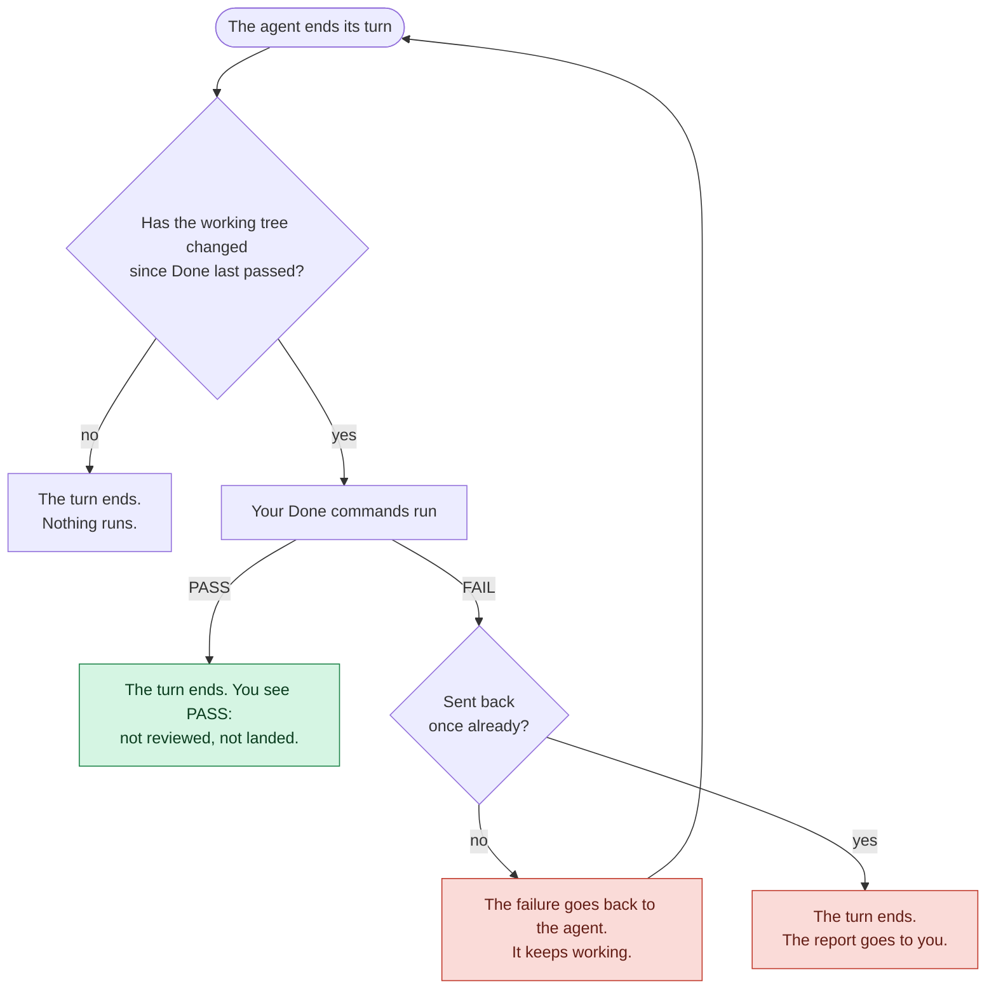
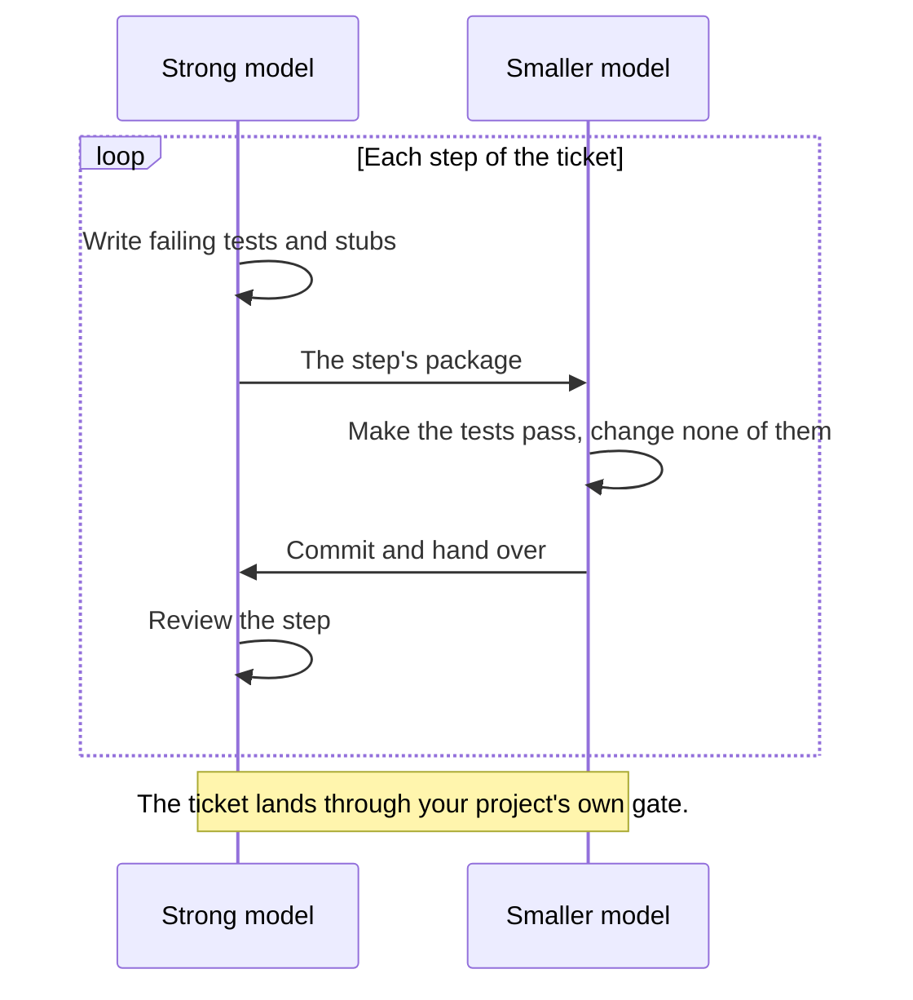

# OutcomeBound

[](https://github.com/rajasdevel/outcomebound/actions/workflows/ci.yml)

**Toward trustworthy delegation to coding agents.**

Hand a coding agent the outcome. OutcomeBound asks it for work sized to that outcome, a true
report of every check, and only the decisions that are yours. It is a short contract in your
`AGENTS.md`, and a small tool that installs the contract and keeps it current. The tool is Python
standard library only, and it does not run your agent.

## What it asks of your agent

A one-line fix should not come back with a design note. A risky change should not come back
without a test, or with a report that says "done" when nothing was pushed. The contract asks for:

- **Right-sized work.** Exactly the engineering the outcome needs, in code and in process.
- **Honest reports.** Each check is `PASS`, `FAIL` or `UNVERIFIED`, and missing evidence is never
  success. A passing test is never reported as a push, and a push never as a deployment.
- **Autonomy within your bounds.** The agent decides what it can, states its assumptions, and
  stops only before an act you did not grant. Your decisions come back as short **decision
  briefs**, each with the options, a recommendation, and whether the choice can be undone.

Here is one, as an agent puts it to you. `outcomebound brief` draws it from the agent's JSON, and
the words follow the plain style of `--human-style ste`:

> #### D1 · The fix needs a migration that rewrites the orders table. When do we run it?
> - 👉 Recommend: C — It stops the bug today and keeps the table rewrite in the window your team already uses · confidence 75% (inferred)
> - Options:
>   - A Run it on Sunday in the maintenance window — No customer sees a slow checkout
>     - 🔻 Downside: The bug stays in production for four more days
>   - B Run it online now, in batches of 10,000 rows — The bug is fixed today
>     - 🔻 Downside: Checkout is slower for about 40 minutes while it runs
>   - C Ship a code-only workaround now, and run the migration on Sunday — The bug stops today, and no one sees a slow checkout
>     - 🔻 Downside: Two changes to review, and the workaround must come out after Sunday
> - Why now: The workaround can ship today only if you choose it before the 16:00 deploy
> - ✅ Checked: The fix and the workaround pass the unit tests, and the migration ran on a copy of staging in 38 minutes
> - ⚠️ Not checked: Load on production during an online run; only a run under real traffic would settle it
> - ⛔ Undo: The migration rewrites 4.2 million rows; going back needs a restore from backup

A second aim is the same quality for less: no ceremony that a change does not need, and
hand-offs that let a smaller, lower-priced model build what a strong model planned
([below](#hand-off-to-a-smaller-model)). This is an aim, not yet a measured result.

## What it changes, measured

The test project suggested a design note, a decision record, the full slow suite and a second
reader for every change. The task was a two-character bug fix, then a small new option. Without
OutcomeBound, every run treated the fix like a feature. With it, every run treated the fix like
a fix.

| Three runs of each task, one model | With OutcomeBound | Without |
| --- | --- | --- |
| Made the change correctly, with a regression test | 6 of 6 | 6 of 6 |
| Skipped the design note and decision record the change did not need | 6 of 6 | 0 of 6 |
| Ran focused tests instead of the slow full suite | 5 of 6 | 0 of 6 |
| **Right-sized, by the task's own bar** | **6 of 6** | **0 of 6** |

Same correctness, less ceremony, and a report you can trust: on the fix, every run with
OutcomeBound named the skipped suite as `UNVERIFIED` and gave the reason. The model was
`gpt-6.1-sol` through Codex, 2026-09-30. Every result, its method and its limits are in the
[evaluation record](docs/evaluations.md).

## Where it stands

| | Today | Planned |
| --- | --- | --- |
| **Right-sized work** | Shown on the over-engineering side: process a change does not need stops | The under-engineering side: a shortcut that breaks something. No task separates the arms there yet |
| **Honest reports** | Shown: a skipped check is named `UNVERIFIED`, with the reason | More harnesses and surfaces |
| **Autonomy in your bounds** | In the contract and the skills; no run in any arm interrupted the person | Measure it on long, multi-session work |
| **Efficiency** | A test-first hand-off took a smaller model from 6 to 9 passes of 9 on three small tasks | Cost per finished task. The install adds text, and text costs tokens: about 27% more per run today. The bet is fewer rounds, and that bet is not yet measured |
| **Models** | OpenAI models through Codex, three runs a cell | Claude, Gemini and open-weight models; more runs |

Two things hold by design. OutcomeBound sizes only process that a project suggests: what your
project requires stays required. And its checks inform you; they are not an authority boundary.
The instruction check is lexical, and you judge what it finds. The quality floor makes a
loosening visible, and your branch protection is what prevents one.

## Try it

You need Python 3.10 or later, a POSIX `sh`, and a Git work tree: Git is the undo. Native
Windows is not tested. The tool installs for Claude Code, Codex, Cursor, Gemini CLI and Amp.
Another harness can use `--harness generic`, and then you check that it loads the files. pi is
not verified yet, so `adopt` refuses it ([references/portability.md](references/portability.md)).

```sh
uv tool install git+https://github.com/rajasdevel/outcomebound@v1.0.0
cd your-repo
outcomebound adopt . --detect
```

`pipx install` and `pip install` into a virtual environment work too. `pip install --user` does
not, because `outcomebound` runs Python isolated (`-I`), which ignores the user site.

`--detect` writes nothing. It prints the install command that your files suggest, for example
`outcomebound adopt . --harness claude-code --fragments python --done 'pytest -q'`. Run it, read
the diff, and commit. Your agent's next session reads the contract. The install writes:

```text
AGENTS.md             the contract; Done, CI test and irreversible edges from your files
.claude/skills/       four skills: sizing, decision briefs, requirements, tests (per harness)
.outcomebound/        the fragments you select, and a manifest of what adopt wrote
CLAUDE.md, GEMINI.md  an @AGENTS.md import, only where the harness needs one
```

Put `outcomebound adopt . --check` in CI: it fails while a block or file is stale, edited or
missing. To upgrade, install a newer tag with `uv tool install --force`, then run
`outcomebound adopt .` again. `adopt` overwrites a block that you edited only with `--force`, and
`outcomebound adopt . --remove` takes out exactly what it wrote.

<details>
<summary>The contract, in full</summary>

Source: [templates/managed-block.agents.md.tmpl](templates/managed-block.agents.md.tmpl). Long form: [OutcomeBound.md](OutcomeBound.md).

```markdown
**OutcomeBound** — neither underengineer nor overengineer: exactly the engineering the
outcome requires.

Frame every task by four inputs. **Outcome**: what becomes observably true, and for whom.
**Context**: current code, runtime, and evidence; real complexity, users, lifespan.
**Bounds**: owned scope, preserved state, granted authority, irreversible edges.
**Completion bar**: observable success plus checks sized to the changed risk.

Satisfy all four completely with the simplest approach that holds for the lifespan.
Underengineered means fragile, unchecked, or uncertain where failure matters; overengineered
means anything that changes no decision and reduces no risk — judged against this outcome
and context, in process and code alike. Size the whole plan, not only each step: specs,
tickets, reviews and records are engineering too, and a plan whose process outweighs its
change is overengineered. Smallest complete, not least work.

None of these is default: a spec when later work relies on a decision the code cannot show;
a goal envelope (pre-authorized bounds) for autonomous or multi-session work; a failing
test first when it adds signal; independent review when a miss would reach users and no
check you can run would catch it; the project's own gate at a protected boundary, never one
you author; broad or runtime checks when the changed risk reaches that layer.

Preserve unrelated work. Reconcile prose with source, tests, runtime, and external state.
Decide what you can and proceed on stated assumptions; batch the user's decisions for
handoff as decision briefs (the `decision-brief` skill). Stop only before expanding authority
or crossing an ungranted irreversible edge.
Delegates receive the same four inputs and bounds.

Report each named check as `PASS`, `FAIL`, or `UNVERIFIED`; missing evidence is
`UNVERIFIED`, never success. Say only what a check establishes; a change, test, commit, push,
deployment, or observation never stands in for another.
```

</details>

## When you want more

### The finish check

With `adopt --finish-check`, your Done commands decide when a turn can end:



It is observed in Claude Code. It is built for Codex, but not yet observed there. The install
report itself says `UNVERIFIED` for the hook, until you see its PASS message end a run.

### Hand off to a smaller model

With the `tickets` fragment, a strong model slices large work into tickets that you accept. The
`hand-off-tickets` skill then gives each implementer what its tier needs: the ticket's brief alone
at the outcome tier, plus the approach, signatures, invariants, edge cases and milestones at the
design tier. At the spec tier, the brief comes from `outcomebound tickets brief <id> --detail full`,
and the work goes one step at a time:



The tier comes from you, or from the research library's placement table. In 63 runs, the spec
package raised `gpt-6-luna` at `xhigh` from 6 to 9 passes of 9, and `gpt-6-astra` at `high`
passed 9 of 9 with it or without it. The whole gain was one requirement on one of three small
tasks, and the design package's effect did not show. Each tier had one model, all from one maker,
through one harness.

### A quality floor for a project with history

Most projects already carry lint and type debt. Fixing all of it first blocks real work, and
ignoring it lets it grow. The floor records the findings you have today, and fails only what is
new. This repository runs on its own floor: 28 old lint findings and 46 old type findings are in
a baseline, and every change since has added none. When a change adds new ones, the check names
them:

```text
FAIL python.lint (2 new, 28 baselined)
  +1 outcomebound_tools/tickets.py:F401:`os` imported but unused  at 260:12
  +1 outcomebound_tools/tickets.py:S307:Use of possibly insecure function; consider using `ast.literal_eval`  at 261:12
FAIL python.types (1 new, 46 baselined)
  +1 outcomebound_tools/tickets.py:no-untyped-def:Function is missing a type annotation  at 259:0
```

An agent that hides a finding instead of fixing it fails too. A new suppression comment, a
baseline that grows or a changed tool config is a loosening, and it passes only when a commit
names the decision that allowed it:

```text
FAIL loosening (1 in origin/main..HEAD; no commit carries Floor-Loosening: <what>; ruled <id>)
  outcomebound_tools/tickets.py adds # noqa: s307
```

`outcomebound floor propose . > floor.json` prints the claims for your stack (Python and shell),
and `outcomebound floor apply . --floor floor.json --accept` fits them to the findings you have
today. It runs your own ruff, mypy, gitleaks and shellcheck with your own configs. The floor makes
a loosening visible; your branch protection is what holds it to a person's decision.

### Also optional

- **Instruction check** (`outcomebound instructions check .`): reports hidden characters, override
  phrases and risky harness settings in the files your agents load. It writes nothing.
- **Text for people** (`adopt --human-style ste`): agents write reports and commit messages for
  people in the style of ASD-STE100 Simplified Technical English.
- **Workspace** (the `workspace` fragment): where several agents share one machine's checkout, four
  folders under `.agents/` hold each task's worktree, working files, hand-off page and shared
  notes, and Git ignores them. The [workspace guide](docs/workspace.md) says what it gives you and
  what it does not.
- **Research** (the `research` fragment): [outcomebound-research](https://github.com/rajasdevel/outcomebound-research)
  is a separate, neutral library about models, providers, harnesses and practices. From a clone
  (`outcomebound research clone <folder> --accept`), `outcomebound research <path>` prints a file
  headed by the clone's commit and the sha256 of its text. An agent cites the file by its path,
  that commit and that digest.

## Contributing and licence

See [CONTRIBUTING.md](CONTRIBUTING.md) (DCO sign-off, no CLA) and [SECURITY.md](SECURITY.md).
Apache-2.0, with one exception: the text that `adopt` writes into your repository carries no
licence-copy or NOTICE duty ([LICENSE](LICENSE)). The OutcomeBound name and mark are not licensed
with the code: you can say that a project uses OutcomeBound, and a fork ships under its own name.

## Acknowledgements

Many of OutcomeBound's ideas come from these projects and standards, named for credit. The text
is our own, and none of them is affiliated with OutcomeBound or endorses it:
[agents.md](https://agents.md/), [agentskills/agentskills](https://github.com/agentskills/agentskills),
[obra/superpowers](https://github.com/obra/superpowers), [mattpocock/skills](https://github.com/mattpocock/skills),
[anthropics/skills](https://github.com/anthropics/skills),
[UKGovernmentBEIS/inspect_ai](https://github.com/UKGovernmentBEIS/inspect_ai),
[ASD-STE100](https://www.asd-ste100.org/). Each idea, with its exact source, is in the research
library's [credited ideas](https://github.com/rajasdevel/outcomebound-research/blob/main/practices/skills.md).
