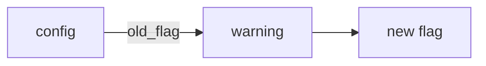

# Decision brief — design

## Outcome

Whenever an agent needs a person's judgment, the person can make it quickly and make it well.
The agent has done the due diligence first: it checked what could change the answer, and worked
out what each way forward leads to and what its downside is. It then puts the question as a
decision brief: concise, direct and visual, with marks the eye can scan, each option's downside in
view, and a diagram where order or flow is the point. How: the `decision-brief` skill, which
carries the procedure and which the kernel and the core skill's "Put a decision to the user"
point to; `outcomebound brief --help`, `decision_brief.py`, `surfaces.py` and
`adapters/surfaces.json`.

## Decisions

| Decision | Rejected alternative | Owner | Status |
| --- | --- | --- | --- |
| Every decision put to a person — in a session, at a handoff, in a tracker comment — is a decision brief, drawn by one renderer, `outcomebound brief`, and shown as markdown, never inside a code block | prose lists; a shape each skill describes in its own words | user | decided |
| A brief holds only the work that waits on its answer. A run starts without answers, writing a brief never ends the turn while other work can go on, and the brief goes where the person will read it: the handoff, the goal's Progress, a comment on the ticket it holds, or the final message when every remaining item waits on an answer (maintainer, 2026-10-04) | the turn's final message as the first place for a brief, which in an unattended harness ends the run | user | decided |
| The procedure — what to decide yourself, the due diligence, the brief's parts, drawing it — lives in one skill, `decision-brief`, a default skill. The kernel's handoff sentence names it, and the core skill keeps only when to ask and a pointer | the procedure inside the core skill, reached only through it | user | decided |
| Due diligence comes before the brief. The agent checks everything within reach that could change the answer, works out what each way leads to and its downside, and lets the evidence choose the recommendation. `Not checked` names only what could not be checked, why, and what would settle it | a form filled from whatever is already in hand | user | decided |
| A brief is a floor, not a form. Always: an id and the question in one line; every way forward when there are two or more, each with what it leads to and its downside; the recommendation first, with why; at least one line of evidence (checked, not checked, or a fact); and whether it can be undone. Anything else appears only when it changes the answer | a fixed form with every slot filled; a brief with no evidence line | user | decided |
| A brief stands on its own. Every internal id or term is explained in plain words where it is used, or left out | ids the person has to look up | user | decided |
| A brief's id is one no other session or record can take: the next of the project's own numbering for briefs where its instructions keep one, else the task's or worktree's name before the number (`fix-login-D1`); a brief cited outside its document carries that whole id. The renderer already accepts such an id, so the rule lives in the skill | a bare `D<n>`, which two sessions on one machine can both take and which reads as one of the project's own decision numbers; an engine verb that reserves the next id, which needs a shared store the skill does not | agent | decided |
| For an act a harness's permission check guards, such as a deletion or a write outside the project, the brief names the act so the person's reply can state it, since some harnesses honor authority only from the person's own words | a letter alone, which such a check does not read as the person's authority for the act | agent | decided |
| A step the person types or checks by eye names a version, branch, tag or path, never a commit hash or other digest: people miss near-matching hex strings more often than words or numbers | a digest to copy or compare by eye | user | decided |
| Marks are emoji where the output carries them (👉 recommend, ✅ checked, ⚠️ not checked, 🔻 downside, 🧱 debt, ↩️ undo, ⛔ cannot be undone), and ASCII where it cannot; each option's downside sits under its own mark, so the recommended option's downside is its risk | ASCII marks everywhere; consequences in prose only | user | decided |
| A diagram is drawn when order, dependency, flow or before/after is the point, never as decoration. It is Mermaid where the surface renders Mermaid, and ASCII where the surface does not or is unknown | one ASCII form for every surface; a diagram in every brief | user | decided |
| The brief itself is in the text the person reads where it goes (the rows above); a link from that text to a file that holds it never stands in for the brief (field: a brief written to a working file and only linked from the message) | a brief kept in a file the message links to | user | decided |
| Where a harness asks the person through a question tool, which shows each field on one line, the agent draws the brief in its message first and asks with `outcomebound brief --ask`, filling the tool's fields by name: per brief, the id, a short header, the heading and recommendation as question, and each option's label, description and one-line form, the recommended option first as the tools ask; a brief whose options the tool cannot take is asked by the drawn brief alone (field: a drawn brief put whole into a question tool's title, shown as one line) | the drawn brief's lines in the tool's fields; no question tool at all | user | decided |
| Whether a surface renders Mermaid is read from the session's environment against `adapters/surfaces.json`, which records who observed each capability, and when. `OUTCOMEBOUND_DIAGRAMS` (the person's own observation) outranks the table, and `--form` outranks both | the agent guessing its surface | user | decided |

## Shape

In the emoji form, where the session's surface renders Mermaid:

````text
### D1 · Keep the old flag for one release?
- 👉 Recommend: A — two adopters still set it · confidence 80% (inferred)
- Options:
  - A keep it — adopters get a warning first
    - 🔻 Downside: one more release carries the old code path
  - B drop it now — the code path goes today
    - 🔻 Downside: an adopter who sets it is refused on upgrade
- ✅ Checked: `grep -r old_flag` finds two adopter configs
- ↩️ Undo: revert the commit

How an upgrade reads the flag

````

The ASCII form writes `[>]`, `[ok]`, `[!]`, `[-]`, `[debt]`, `[undo]` and `[!!]`, the separators
` | ` and ` - `, and the diagram as chains in a `text` fence: `config --old_flag--> warning --> new flag`.
A batch that names an order among its briefs ends with the order drawn the same way.

## Edges

The command refuses what it can detect — an option without its downside, a single option, two
or more options with no recommendation, a brief with no evidence line, a mark's glyph inside
given text, a line break inside a field, a diagram label that would end or split an edge
(`--help` lists every refusal) — and cannot tell whether the due diligence was done well. The
verdicts on a `Checked` line are the agent's own report, and the passed mark is drawn only when
every verdict is PASS. A surface missing from the table gets ASCII. A surface the table records
as rendering Mermaid but that sets no environment variable is chosen with `--form mermaid`, never
detected. A person can correct the table with their own observation through
`OUTCOMEBOUND_DIAGRAMS` until the table records it.

## Validation

`tests/test_decision_brief.py`, `tests/test_decision_brief_cli.py`, `tests/test_surfaces.py`;
`outcomebound brief` draws the example in `--help` in both forms. `tests/test_adopt.py` installs,
checks and removes the skill beside the core skill.
