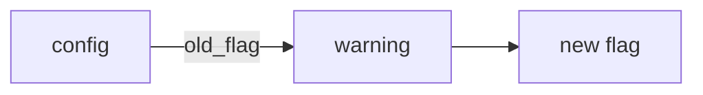

# Decision support — design

This design joins the decision brief, whose design was ratified as `docs/specs/decision-brief/`,
and the explorable into one area: every way an agent puts a judgment, a lesson or a question to a
person.

## Outcome

Whenever an agent needs a person's judgment, or needs a person to understand or answer something,
the person can do it quickly and do it well. Two instruments serve this. The decision brief puts
every decision in text, always. The explorable adds a page, only where text serves the person
badly.

### The decision brief

Whenever an agent needs a person's judgment, the person can make it quickly and make it well.
The agent has done the due diligence first: it checked what could change the answer, and worked
out what each way forward leads to and what its downside is. It then puts the question as a
decision brief: concise, direct and visual, with marks the eye can scan, each option's downside in
view, and a diagram where order or flow is the point. How: the `decision-brief` skill, which
carries the procedure and which the kernel and the core skill's "Put a decision to the user"
point to; `outcomebound brief --help`, `decision_brief.py`, `surfaces.py` and
`adapters/surfaces.json`.

### The explorable

When a person must decide, learn or answer something that text alone shows badly, the agent gives
them an explorable: one HTML file, opened from disk, in which the person changes values, steps
through flows, reads charts and answers questions, and then copies a reply back to the agent. The
person decides, or learns, with evidence they can try for themselves, and the agent gets their
answer in words it can act on.

An explorable has three kinds:

- a **decision** explorable puts one or more decision briefs in a form the person can explore:
  each option's mechanism, the measures the choice turns on, the values the person may judge
  differently, and how far each value must move before the answer changes;
- a **learning** explorable teaches a mechanism by asking the person to predict, try and recall;
- an **interview** explorable asks the person the questions whose answers the work waits on.

The name comes from the essay "Explorable Explanations" (2011,
<https://worrydream.com/ExplorableExplanations/>): a document that the reader changes and explores.

How: the `explorable` skill (when to make one, what each kind holds, and the guards); the verb
`outcomebound explorable` (`outcomebound_tools/explorable.py` and the modules beside it), which
writes a starter source, joins the source to the shared shell, and checks the page; the shell
under `templates/explorable/` (the page frame, the shared stylesheet, the runtime script and the
library pins); the source header schema `schemas/explorable-source.schema.json`; and the HTML
drawing of a brief, beside the markdown drawing of `outcomebound brief`.

`outcomebound explorable check` holds one invariant: a page it passes carries the engine's shell
unchanged, references nothing outside what the policy allows, holds the parts its kind needs, and,
with `--browser`, runs with no script error and shows, for each declared expectation, the value the
agent expected. A pass never says that the page's content is right.

The completion bar for one explorable: `check` passes on the page; where a Chromium-family browser
is on the machine, `check --browser` passes, and the agent's report names each output that reads `UNVERIFIED`; the decision brief is in the text the person reads, as
the decision-brief rows above require; and the agent names the page's path. Where no such browser
exists, the run of the page is `UNVERIFIED`, and the agent says so.

## Requirements

These come from the request that added the explorable.

- R1 A portable, self-contained HTML file helps a person make a complex decision with confidence:
  interactive diagrams, calculators like a spreadsheet, sliders, charts, timelines and animations,
  whatever the decision needs (maintainer, 2026-10-06).
- R2 Libraries come from a CDN where a page opened from disk can load them, to keep the file small
  (maintainer, 2026-10-06).
- R3 The same machinery makes pages for learning and for grilling (maintainer, 2026-10-06).
- R4 The name is not "artifact", which a vendor's chat product uses for its own feature
  (maintainer, 2026-10-06); the name is "explorable" (maintainer, 2026-10-07).
- R5 The page follows the browser's dark or light setting by itself (maintainer, 2026-10-06).
- R6 Every page uses one shared stylesheet (maintainer, 2026-10-06).
- R7 The model writes the page's HTML and script from a starter file; the engine ships the shell
  (shared CSS, theme, CDN tags) and a check verb (maintainer, 2026-10-07).
- R8 Decision, learning and interview explorables all ship in 1.4.0 (maintainer, 2026-10-07).
- R9 Each option's mechanism is clear on its own, and the page holds only what changes the decision
  (field: a model-built decision page had to be redone because each option's data flow was not
  clear and the page carried material the decision did not need).

## Decisions

### Decisions on the brief

| Decision | Rejected alternative | Owner | Status |
| --- | --- | --- | --- |
| Every decision put to a person — in a session, at a handoff, in a tracker comment — is a decision brief, drawn by one renderer, `outcomebound brief`, and shown as markdown, never inside a code block | prose lists; a shape each skill describes in its own words | user | decided |
| A brief holds only the work that waits on its answer. A run starts without answers, writing a brief never ends the turn while other work can go on, and the brief goes where the person will read it: the handoff, the goal's Progress, a comment on the ticket it holds, or the final message when every remaining item waits on an answer (maintainer, 2026-10-04) | the turn's final message as the first place for a brief, which in an unattended harness ends the run | user | decided |
| The procedure — what to decide yourself, the due diligence, the brief's parts, drawing it — lives in one skill, `decision-brief`, a default skill. The kernel's handoff sentence names it, and the core skill keeps only when to ask and a pointer | the procedure inside the core skill, reached only through it | user | decided |
| Due diligence comes before the brief. The agent checks everything within reach that could change the answer, works out what each way leads to and its downside, and lets the evidence choose the recommendation. `Not checked` names only what could not be checked, why, and what would settle it | a form filled from whatever is already in hand | user | decided |
| A brief is a floor, not a form. Always: an id and the question in one line; every way forward when there are two or more, each with what it leads to and its downside; the recommendation first, with why; at least one line of evidence (checked, not checked, or a fact); and whether it can be undone. Anything else appears only when it changes the answer | a fixed form with every slot filled; a brief with no evidence line | user | decided |
| A brief stands on its own. Every internal id or term is explained in plain words where it is used, or left out | ids the person has to look up | user | decided |
| A brief's id is one no other session or record can take: the next of the project's own numbering for briefs where its instructions keep one, else the task's or worktree's name before the number (`fix-login-D1`); a brief cited outside its document carries that whole id. The renderer already accepts such an id, so the rule lives in the skill | a bare `D<n>`, which two sessions on one machine can both take and which reads as one of the project's own decision numbers; an engine verb that reserves the next id, which needs a shared store the skill does not | agent | decided |
| For an act a harness's permission check guards, such as a deletion or a write outside the project, the brief names the act so the person's reply can state it, since some harnesses honor authority only from the person's own words | a letter alone, which such a check does not read as the person's authority for the act | agent | decided |
| The floor gains one line: what happens if no answer comes and the state the held work waits in, as a `facts` pair labelled `If unanswered`; it is a `facts` pair, not a schema field: the renderer already draws a `facts` pair as its own unmarked line, so a new field would add a refusal and a schema version for a line the text can carry. A hold still holds only its own item (field: a held act left a service stopped, with no stated fallback) | an optional `if_unanswered` field in the schema, which adds a wire change and a refusal to settle what one skill sentence settles | agent | decided |
| A step the person types or checks by eye names a version, branch, tag or path, never a commit hash or other digest: people miss near-matching hex strings more often than words or numbers | a digest to copy or compare by eye | user | decided |
| Marks are emoji where the output carries them (👉 recommend, ✅ checked, ⚠️ not checked, 🔻 downside, 🧱 debt, ↩️ undo, ⛔ cannot be undone), and ASCII where it cannot; each option's downside sits under its own mark, so the recommended option's downside is its risk | ASCII marks everywhere; consequences in prose only | user | decided |
| A diagram is drawn when order, dependency, flow or before/after is the point, never as decoration. It is Mermaid where the surface renders Mermaid, and ASCII where the surface does not or is unknown | one ASCII form for every surface; a diagram in every brief | user | decided |
| The brief itself is in the text the person reads where it goes (the rows above); a link from that text to a file that holds it never stands in for the brief (field: a brief written to a working file and only linked from the message) | a brief kept in a file the message links to | user | decided |
| Where a harness asks the person through a question tool, which shows each field on one line, the agent draws the brief in its message first and asks with `outcomebound brief --ask`, filling the tool's fields by name: per brief, the id, a short header, the heading and recommendation as question, and each option's label, description and one-line form, the recommended option first as the tools ask; a brief whose options the tool cannot take is asked by the drawn brief alone (field: a drawn brief put whole into a question tool's title, shown as one line) | the drawn brief's lines in the tool's fields; no question tool at all | user | decided |
| Whether a surface renders Mermaid is read from the session's environment against `adapters/surfaces.json`, which records who observed each capability, and when. `OUTCOMEBOUND_DIAGRAMS` (the person's own observation) outranks the table, and `--form` outranks both | the agent guessing its surface | user | decided |

### Decisions on the explorable

| Decision | Rejected alternative | Owner | Status |
| --- | --- | --- | --- |
| The page type is called an explorable, with three kinds: decision, learning and interview. The skill is `explorable` and the verb `outcomebound explorable` (maintainer, 2026-10-07) | workbench; sheet; artifact, which collides with a vendor's feature and with this engine's install artifacts | user | decided |
| The model writes the page's content and script; the engine ships the shell and the check (maintainer, 2026-10-07). The engine does not compute the page's numbers | the engine builds the whole page from a JSON document with a formula language, which checks the arithmetic but limits what a page can show; guidance alone, with no shell and no check | user | decided |
| All three kinds ship together in 1.4.0, as one slice of the 1.4.0 work (maintainer, 2026-10-07) | decision explorables first and the other kinds in a later release; all three in 1.5.0 | user | decided |
| An explorable adds to a decision brief and never replaces it. The brief is in the text the person reads (the message, the handoff, the ticket comment), and the page's path is named beside it. A decision explorable shows the same brief at its top | a page that holds the brief, linked from the message, which the decision-brief rows above refuse | user | decided |
| An agent makes an explorable only where text serves the person badly: a decision whose answer turns on values the person may judge differently from the agent, or on how options work in ways that text compares poorly; a mechanism the person must learn, where trying it teaches more than reading; a set of questions that is easier to answer on a page than in a chat; or a request from the person. A choice that the brief settles alone gets no page | an explorable for every brief, which adds work that changes no decision; an explorable only on request, which misses the case the request described | agent | decided |
| A decision explorable holds, in this order: the briefs; each option's mechanism, drawn so that what differs between options shows first, with one colour and label for each kind of work; the measures the choice turns on, each with its value for each option and its source; what-if inputs for the values the person may judge differently or that are unknown; for each input that decides the choice, how far it must move before the answer changes; a timeline where time or reversibility differs between options, with the point after which an option cannot be undone; a question that asks the person to imagine the leading option has failed and say why; and the reply. It holds nothing that does not change the decision | a general report on the area with the decision at its end, which the field example showed hides the options' differences | agent | decided |
| A learning explorable starts from what the person already knows and lets them skip it. It asks for a prediction before each reveal, lets the person step through a flow at their own pace, gives a model they can change where quantities matter, and asks recall questions on earlier parts later. Its reply carries the person's answers. The agent reports what the person answered and never that they understand, as `explain-spec` says | a page to read, with no question; a quiz with no explanation | agent | decided |
| An interview explorable asks the questions the work waits on, drawn from the open forks (`gather-requirements`) or from a spec's rows (`explain-spec`): one idea in each question, the most important first, the options of equal length, the agent's recommended answer marked and never preselected, and "I don't know" always offered. The reply carries each answer, and the agent records it where the work is recorded | questions in the chat one at a time, which suits a few questions but not a long set; a form that preselects the recommendation, which anchors the answer | agent | decided |
| Four aids from the decision research are left out of the first build: asking the person's own pick before showing the recommendation, since the brief's floor puts the recommendation first (a decided decision-brief row above); outcomes drawn as countable dots, since a range from low to high and the threshold carry the uncertainty that a choice turns on, with less runtime; a page on which the person adds or removes options, since the options are the brief's and the person can name another in the reply's note; and weighted scores with pairwise comparison, whose rankings can reverse when an option is added | each aid in the first build | agent | assumed |
| The model writes a source file, and `outcomebound explorable build` joins it to the shell: the frame, the policy, the shared stylesheet, the runtime script, the brief and the reply section. The model never reads or copies the shared parts, and every page gets the same ones | a starter file that holds the whole shell, which the model reads again at every edit; a page that links the shared files from a CDN at a release tag, which fails for an engine ahead of its last tag and for a page opened offline | agent | decided |
| A source is an HTML fragment: content sections and the page's own scripts. Its first element is a JSON header, `<script type="application/json" data-explorable>`, with `kind`, `id`, `title` and, for a decision, `brief`: the path of the brief document, relative to the source's folder and inside it. `schemas/explorable-source.schema.json` defines the header's fields. Python checks beside the schema hold what `schemacheck` cannot express: `brief` is required for a decision and refused for the other kinds, the path is bounded, and nothing comes before the header. A source's name ends in `.source.html`, and the page has the same name without `.source` | the kind and title as command flags, which an agent must repeat at every build; a source that is a whole document, whose head and policy the agent could change | agent | decided |
| A source holds no element the shell owns: no doctype, `html`, `head`, `body`, `meta`, `link`, `base`, `style`, `form`, `iframe`, `object` or `embed` element. No attribute that loads or sends (`src`, `href`, `xlink:href`, `srcset`, `srcdoc`, `action`, `formaction`, `poster`, `data`, `ping`, `cite`, `background`) holds anything but a fragment (`#…`) or a `data:` URL, and no `style` attribute holds a `url()` that is not `data:`. The one exception is an `a` element whose `href` is an `https:` URL, which cites a source; `build` gives it `rel="noopener noreferrer"` and `referrerpolicy="no-referrer"`. A `javascript:` URL is refused everywhere. Script text that no check would read is refused too: any `on...` event attribute, a self-closing `<script/>`, a script whose `type` is neither empty nor JSON data (an import map and speculation rules among them), `srcset`, and, anywhere after the header, script text included, `<!`, `<?` and `</html`, which a browser and Python's parser read differently or which end the printed document. `build` refuses such a source and names the line | accepting them and relying on the policy alone, which a later edit to the shell could weaken without a test; refusing every link, which takes away a measure's citation | agent | decided |
| `new` never writes over an existing file. `build` writes over a page it built, which the generator `meta` marks, a person's edits to that page included, since the source is the file to edit; it refuses to write over any other file | `build` refusing every existing page, which makes each rebuild a manual delete | agent | decided |
| Libraries: Chart.js for charts and Mermaid for diagrams, flows and Gantt timelines, both from jsDelivr at exact versions that one file, `templates/explorable/libraries.json`, pins. Every other need uses what the browser has: range and number inputs, tables, SVG, CSS transitions, `details`. No CSS framework, no reactive framework, no formula engine, no math typesetting. A library loads only when the page calls for it. The pins are reviewed at each release, and a page built by an older engine fails the pins verdict with `next: build again` | ECharts, Vega-Lite and Observable Plot, each larger for this use; HyperFormula and Handsontable, whose licences restrict use; GSAP, whose licence is not open source; Pico.css, archived on 2026-10-04 | agent | decided |
| Mermaid is pinned at 11.17.2, not 12.1.0: on 2026-10-06, a page with a flowchart and a gantt loaded a 494 KB compressed layout chunk on 12.1.0 and not on 11.17.2, and the cause is `UNVERIFIED` | the newest release, four days old when checked | agent | assumed |
| Chart.js loads as one script with an integrity hash (SRI) and `crossorigin="anonymous"`. Mermaid loads as an ES module whose chunks cannot carry an integrity hash, so the exact version and the policy's path for that version hold it instead | Mermaid's one-file build, which carries a hash but is far larger (1.5 MB compressed for 12.1.0; the size for 11.17.2 is `UNVERIFIED`); no hashes at all | agent | decided |
| The page's first head element is a Content-Security-Policy `meta` tag: `default-src 'none'`; `script-src 'unsafe-inline'` and, for each pin, the package's path at its version (`https://cdn.jsdelivr.net/npm/<package>@<version>/`); `style-src 'unsafe-inline'`; `img-src data: blob:`; `font-src data:`; `form-action 'none'`; `base-uri 'none'`. It stops every fetch and post, every form submission, and every load of a style, image or font from any address; a script loads only from the pinned package paths. It does not stop a navigation that the page's own script starts, or a window it opens: no directive that a `meta` tag carries is known to, and navigation was not tested (`UNVERIFIED`). The skill therefore says that page code never navigates, never opens a window, and loads nothing but the pinned libraries, and that rule is the skill's, not the engine's. A page runs in the person's browser, outside any harness's sandbox, and it cannot load live data: its data is in the page | no policy, so that page code could call any host; the whole library host, which lets page code load any package from it; `connect-src 'none'` alone, which leaves images and styles open | agent | decided |
| Without the network the page still works: inputs, results, tables, the brief, the questions and the reply need no library. A chart whose library does not load shows its data table, a diagram shows its source text, and a banner says which parts need the network | a page that is blank offline; libraries copied into each page, which makes a large file | agent | decided |
| Every page follows `prefers-color-scheme`. The stylesheet defines its colours as tokens for light and dark; charts and diagrams take their colours from those tokens and draw again when the setting changes. The palette is safe for colour-blind readers, and colour never carries meaning alone: a label, a mark or a shape goes with it. Print uses the light tokens: charts draw again in light before print, and the runtime keeps a light drawing of each diagram for print when the page is dark | a light page only; a theme switch on the page, which the person must find | user | decided |
| One shared stylesheet, `templates/explorable/explorable.css`, styles every kind. A source holds no `style` element, which `build` refuses. That a `style` attribute appears only where page code sets a computed value is a rule of the skill; `build` refuses only a `url()` in it | a stylesheet in each page that the model writes | user | decided |
| The runtime script, `templates/explorable/explorable.js`, gives page code one object, `explorable`, with the parts that pages need again and again and that are easy to get wrong: named inputs (`data-input`) read as numbers, text or booleans, with an empty input read as unknown; `onChange`, which calls page code on load and on each change; `show`, which writes a result into its `data-output` element with a stated precision, shows a pair as a range from low to high, and shows unknown with the inputs named in its `waits` option, or else the inputs that are empty; charts and diagrams that load their library, follow the theme, and carry a fallback; flows with one colour and label for each kind of work, and classes for what an option adds, removes or changes; tabs; step-through with controls the person drives; a timeline; questions with an "I don't know" answer; `threshold`; expectations; saved state; and the reply. A range is two inputs, the low and the high. `skills/explorable/references/runtime.md` describes the object and the attributes, and a test holds the two to each other | no runtime, so that each page writes these parts again; a runtime that draws the whole page from data, which the maintainer's ruling rejects | agent | decided |
| `explorable.threshold(input, chooser)` runs the page's own `chooser`, a function from the current values to an option's letter, over the input's range from its `min` to its `max` in its `step`, in both directions from the current value, and returns the nearest value at which the letter changes, or that it does not change within the range. It claims nothing beyond the page's own chooser | a sensitivity chart that each page draws by hand; a tornado chart, which needs a range for every input | agent | decided |
| An expectation is stated over the page as the person sees it: `explorable.expect(label, inputs, outputs)` names input values and the result each named output must then show. With `#explorable-check` in the address, the runtime sets those inputs, lets the page's own change handlers run, reads each output that `show` wrote, and compares it with the expected value at the output's shown precision. It writes the results, and the count of outputs with and without an expectation, into `<script type="application/json" id="explorable-check-result">`. A pass says that for those inputs the page shows what the agent expected; the expected value is the agent's own claim. The skill asks the agent to work each one out by hand or with another tool and to keep the working beside the page, and that is a rule of the skill | `explorable.expect(label, compute, expected)` over a function the agent writes, which checks only that function, not what the page shows; no expectation at all | agent | decided |
| The browser check finds a Chromium-family browser: `OUTCOMEBOUND_BROWSER` as a path first, then `google-chrome`, `chromium`, `chromium-browser`, `msedge` and `brave` on the `PATH`, then the install folders of Chrome, Chromium, Edge and Brave on macOS and Windows. It starts the browser headless, in its own process group, with a new profile folder, the page's `file://` address (built with `Path.as_uri()`) and the `#explorable-check` fragment, and `--dump-dom`. It reads the browser's output until the document ends, then stops the whole group it started and removes the profile folder, retrying the removal on Windows. It passes `--use-mock-keychain` and `--password-store=basic`, without which Chrome on macOS waited about thirty seconds on the keychain for a new profile when `HOME` was not the person's own (observed 2026-10-07), and, only when it runs as root, as in a container, `--no-sandbox`, which runs the page outside Chrome's own sandbox. The time limit, which `--timeout` raises, is the failure path: the run then reads `UNVERIFIED` and names the limit. Headless Firefox cannot print the page's document, so a machine with only Firefox, or only Safari, reads `UNVERIFIED` | waiting for the browser to exit, which it does not do after printing the document (observed with Chrome 154 on 2026-10-07); stopping only the main process, which left a helper process running in the same run; a screenshot read by eye; a browser driver such as Playwright, which is not in the standard library | agent | decided |
| `check` reports separate verdicts, the first output line being the overall verdict: the shell (the policy first and unchanged, the generator and the kind, and each inlined part, the stylesheet, the runtime and the library pins, equal to the engine's template text exactly, so that a page built by another engine version fails with `next: build again`); the hosts (a static read of the attributes, the `style` values and the string literals in the text of every script but the header, JSON data included, that could name an address, against what the policy and the citation exception allow, with the `rel` and `referrerpolicy` that `build` adds present on each citation); the parts each kind needs (decision: a brief and the reply; learning and interview: at least one `data-question` and the reply); and, with `--browser`, the run (no script error; each expectation passes; each output with no expectation reads `UNVERIFIED`). Exit 0 when nothing fails, with any `UNVERIFIED` named; exit 1 on a `FAIL`; exit 2 when the page cannot be read or on a usage error. There is no `--json`: the agent reads the text, and the eval fixture's post-check reads only the exit status | one verdict for the page, which hides which part failed; a `--json` report with a schema, which no consumer needs yet | agent | decided |
| A decision explorable draws its briefs from the same JSON document that `outcomebound brief` reads, with the same refusals, through an HTML drawing in `decision_brief.py` or a module beside it. A brief's diagram and a batch's order become `data-diagram` blocks that the runtime draws with Mermaid, with the ASCII chain form as their fallback text. The reply offers each brief's options by letter and way. The markdown drawing stays the one way a decision is put to a person; the page's copy is in addition | a brief that the page code writes by hand, which can disagree with the brief in the message | agent | decided |
| The reply is one block of text that the runtime builds and shows at all times, in a line grammar that `runtime.md` defines and a test holds: a first line with the page's id and build time; one line for each brief's choice (id, letter, way); one line for each input the person moved (name, the agent's value, the person's value, unit); one line for each answer (question id and answer, "I don't know" kept as an answer); and the note. A copy button writes it to the clipboard after a click and falls back to selecting the text | answers sent from the page, which the policy forbids and which needs a server; a downloaded file, whose folder the agent does not know | agent | decided |
| A chart's fallback is its data table: the runtime builds the table from the chart's own labels and values, shows it when the library does not load, gives it to screen readers, and prints it | three separate forms for offline, screen readers and print | agent | decided |
| The page saves the person's values and answers in the browser's local storage under a key made of the page's id and build time, wrapped so that a browser that refuses storage still works, with a button that restores the agent's values. A rebuild starts from the agent's values, since a rebuild can change the inputs. Chrome shares one local storage area across every file opened from disk (observed with Chrome 154 on 2026-10-07), so a second button, "Forget what I entered", clears the person's entries from the page and from storage, and the skill asks the agent to point a person with private answers to it The build time comes from `SOURCE_DATE_EPOCH` where it is set, so that tests can build the same page twice | no saved state, so that a reload loses the person's work; state in the address fragment, which a page opened again from disk does not have; a key of the id alone, which carries old values into a rebuilt page whose inputs changed | agent | decided |
| Guards against misleading the person: every value the agent supplies is labelled with its source (checked, assumed, or the person's); an unknown value stays empty, and every result that needs it says so; an uncertain value is a range, never one exact number; results show only the precision the inputs support; the reply lists each input the person moved and in which direction; animation moves only when the person starts it, and stops under `prefers-reduced-motion` | showing the recommendation's numbers as fact | agent | decided |
| The skill's diagram guidance, in OutcomeBound's own words, takes its ideas from `cathrynlavery/diagram-design`, which the README already credits: choose the diagram by what the reader must learn, and use a table where a table says the same; every node is one idea and every line carries information; one or two elements carry the accent; a diagram that needs a guide to read becomes an overview and a detail; an option's change from today is drawn as a change (added, removed, changed) against the current state; the page holds its meaning with motion off; every diagram has a text title and description for screen readers | that skill's own layout system and hand-drawn SVG, which take far more model output for each diagram; Mermaid's automatic layout is the trade the small-file goal makes | agent | decided |
| One skill, `explorable`, serves all three kinds and is a default skill in every install. `decision-brief`, `explain-spec` and `gather-requirements` each point to it in one line, for the case where their work needs a page | a skill for each kind, which would repeat the shell, the checks and the guards three times | agent | decided |
| An explorable is a working file: its source, its brief document, the working behind its expectations and its page go in the project's working area (`.agents/work/<task>/` where the workspace fragment applies), never into a design folder or a commit unless the person asks, since a page can hold private facts. The agent opens the page for the person only when the person asks, or is at the machine and the work waits on them, with the system's opener (`open` on macOS, `xdg-open` on Linux, `wslview` under WSL; on Windows `Invoke-Item` or `start ""`, which are `UNVERIFIED`), and otherwise names its path | pages committed beside the design; a page opened in every run, unattended ones included | agent | decided |
| The shell, stylesheet, runtime and pins live under `templates/explorable/`, which ships in the package and which the verb reads from the engine's home. The skill folder holds only markdown, which the instruction audit reads | the shell in the skill folder, which `adopt` copies into every adopter's tree and which the audit, reading only markdown there, would not read | agent | decided |
| The idea of a document whose numbers the reader changes is credited: the README's acknowledgements link `worrydream/Tangle`, the reactive-document library by the essay's author. The research record names the essay through an entry sent with `outcomebound research ingest`, which is a separate act under the maintainer's grant, since a push to the research repository is an irreversible edge. No text or code is taken from either | no credit; a link to the essay in the README, which links GitHub repositories only | agent | decided |

## Shape

### A decision brief

In the emoji form, where the session's surface renders Mermaid:

````text
### D1 · Keep the old flag for one release?
- 👉 Recommend: A — two adopters still set it · confidence 80% (inferred)
- Options:
  - A keep it — adopters get a warning first
    - 🔻 Downside: one more release carries the old code path
  - B drop it now — the code path goes today
    - 🔻 Downside: an adopter who sets it is refused on upgrade
- ✅ Checked: `grep -r old_flag` finds two adopter configs
- ↩️ Undo: revert the commit

How an upgrade reads the flag

````

The ASCII form writes `[>]`, `[ok]`, `[!]`, `[-]`, `[debt]`, `[undo]` and `[!!]`, the separators
` | ` and ` - `, and the diagram as chains in a `text` fence: `config --old_flag--> warning --> new flag`.
A batch that names an order among its briefs ends with the order drawn the same way.

### An explorable

A decision source, as `outcomebound explorable new --kind decision` starts one:

```html
<script type="application/json" data-explorable>
{"kind": "decision", "id": "cache-choice", "title": "Which cache for the reports API?",
 "brief": "briefs.json"}
</script>

<section>
  <h2>How each option works</h2>
  <div data-tabs>
    <section data-tab="A in-process cache"><pre data-diagram>flowchart LR
  req[request] -->|on request| cache[in-process cache]:::k1
  cache -->|miss| db[(database)]:::k2</pre></section>
  </div>
</section>

<section>
  <h2>What if</h2>
  <label>Requests per second <input type="range" data-input="rps" data-unit="req/s"
    data-source="checked" min="10" max="500" step="10" value="120"></label>
  <label>Hit rate <input type="number" data-input="hit" data-unit="%" data-source="assumed"
    value=""></label>
  <p>Database load: <output data-output="dbLoad"></output></p>
</section>

<script>
  const model = (v) => ({ dbLoad: v.hit === null ? null : v.rps * (1 - v.hit / 100) });
  explorable.onChange((v) => explorable.show("dbLoad", model(v).dbLoad, { unit: "req/s" }));
  explorable.expect("120 req/s at a 75% hit rate", { rps: 120, hit: 75 }, { dbLoad: 30 });
</script>
```

The hit rate starts empty, so the database load reads as unknown until the person sets it. The
expectation sets both inputs and reads what the page shows.

A learning or interview source uses questions and steps:

```html
<section data-steps>
  <figure data-step><pre data-diagram>sequenceDiagram
  client->>cache: get</pre><figcaption>The client asks the cache first.</figcaption></figure>
  <figure data-step>…</figure>
</section>

<fieldset data-question="Q1" data-kind="predict">
  <legend>With a 90% hit rate, how many requests reach the database?</legend>
  <input type="number" data-unit="req/s">
  <div data-explain>One request in ten misses the cache: 12 req/s.</div>
</fieldset>
```

The page that `build` writes, from top to bottom: the policy, the shared stylesheet, a header with
the title, kind and build time, the network banner (hidden until a library fails), the briefs, the
source's content, the reply section, and the runtime and the source's scripts.

## Edges

### Edges of the brief

The command refuses what it can detect — an option without its downside, a single option, two
or more options with no recommendation, a brief with no evidence line, a mark's glyph inside
given text, a line break inside a field, a diagram label that would end or split an edge
(`--help` lists every refusal) — and cannot tell whether the due diligence was done well. The
verdicts on a `Checked` line are the agent's own report, and the passed mark is drawn only when
every verdict is PASS. A surface missing from the table gets ASCII. A surface the table records
as rendering Mermaid but that sets no environment variable is chosen with `--form mermaid`, never
detected. A person can correct the table with their own observation through
`OUTCOMEBOUND_DIAGRAMS` until the table records it.

### Edges of the explorable

What each verdict reads, and who can write it. `build` reads the source, the brief document the
header names, and the engine's templates. `check` reads the page file and, with `--browser`, the
document the browser prints after the page has run. The agent writes the source, the brief
document, the expectations and their expected values, and so the page: every verdict rests on data
the agent wrote, except the shell, the pins and the policy, which come from the engine's templates.
A pass therefore says that the page is the shell plus the agent's content, with the parts its kind
needs, and that for the declared inputs it shows what the agent expected. It never says that the
content is right, that the options are the real ones, or that an output with no expectation is
right; the report says so.

`build` refuses a source whose header breaks the schema or the checks beside it, a decision source
whose brief document is missing or one that `outcomebound brief` would refuse, and any element or
reference the rows above refuse. The hosts verdict is a static read: it cannot see an address that
page code builds at run time, which the policy stops at run time for every load and send but not
for a navigation. A custom chart, layout or animation that page code draws itself is checked only
for script errors in the run. A Chromium-family browser on the machine is the only way the check
runs the page; machines with only Firefox or only Safari read `UNVERIFIED`. A page opened through a
harness's preview server on the loopback address behaves as it does from disk, except that it could
then read a file beside it, which no page relies on. Local storage is per browser and per machine:
a page sent to a colleague opens with the agent's values. In Chrome, every page opened from disk
reads the same storage, so another local page can read what the person entered until they press
"Forget what I entered"; Firefox and Safari are `UNVERIFIED`. The refusals were checked with the
`html.parser` of Python 3.10.20 and 3.14.8; an older 3.10 build without that module's security
fixes may read some end tags in script text differently (`UNVERIFIED`).

## Other designs this change edits

- `skills`: the set gains `explorable`, installed in every install, with its pain (a decision,
  lesson or interview that text serves badly) and its fixture row.
- `install`: the count of working skills; `templates/explorable/` ships with the engine and is never
  copied into an adopter's tree.
- The contract, `OutcomeBound.md`, names the count of working skills, so its edit is a `review`
  item; `README.md`, `AGENTS.md`, `evals/README.md` and `skills/adopt-outcomebound/SKILL.md` carry
  the same count.

## Validation

### Validation of the brief

`tests/test_decision_brief.py`, `tests/test_decision_brief_cli.py`, `tests/test_surfaces.py`;
`outcomebound brief` draws the example in `--help` in both forms. `tests/test_adopt.py` installs,
checks and removes the skill beside the core skill.

### Validation of the explorable

- `tests/test_explorable.py`: `new` writes a starter source for each kind that `build` accepts and
  `check` passes, and never writes over a file; `build` refuses each element, attribute and address
  the rows refuse, a bad header, a header that is not first, a decision source with no brief, and a
  brief path outside the source's folder; `build` writes over its own page and refuses any other
  file; the page's first head element is the policy, unchanged; every library reference is a pin
  from `libraries.json`; brief text with HTML characters is escaped; `check` fails a page whose
  policy, pins or required parts were changed; two builds with one `SOURCE_DATE_EPOCH` are equal.
- `tests/test_explorable_browser.py`: where a Chromium-family browser is found, the starter page of
  each kind runs with no script error, its expectations pass, and its reply matches the grammar;
  a page with a wrong expectation fails; a page that changes an output with no expectation reads
  `UNVERIFIED` for it. The test passes with no network, since a library that fails shows its
  fallback, which is not a script error; whether the libraries load is `UNVERIFIED` in the suite.
  Where no browser is found, the test is skipped with its reason, which the CI's `-rs` prints. The
  hosted ubuntu and Windows jobs are the evidence that discovery works on Linux and Windows; the
  slim and alpine container jobs have no browser and skip.
- A test that every `explorable.<name>` and every attribute that `runtime.md` documents exists in
  `explorable.js`, and the reverse.
- `tests/test_decision_brief_html.py`: the HTML drawing of the example brief, its escaping, its diagram
  and order as `data-diagram` blocks, and the same refusals as the markdown drawing.
- The skill: `tests/test_skill_frontmatter.py`, `tests/test_skill_paths_resolve.py`,
  `tests/test_model_text_limits.py`, `tests/test_no_economic_vocabulary.py`, `outcomebound
  instructions check`, and one eval fixture whose prompt holds two decisions: one that turns on
  values the person judges, where a page helps, and a yes-or-no choice with one clear downside,
  where a page must add no work. Its post-checks run `outcomebound explorable check` without
  `--browser` on the page the agent left, refuse a starter built unchanged, and read the answer
  for a brief on each decision. Until the fixture
  runs, what the skill does for an adopter is `UNVERIFIED`.
- Before landing, recorded in the pull request: the pins load from a page opened from disk in a
  headless browser, with the policy in place, in light and dark. Run on 2026-10-07 with Chrome 154
  on macOS under the path-limited policy above, in light and in dark: Chart.js 4.5.1 with its hash
  and Mermaid 11.17.2 (a flowchart and a gantt) drew with no policy violation, and a module from
  another package and another Mermaid version were refused. Firefox, Windows and Linux under the
  policy are `UNVERIFIED`.
