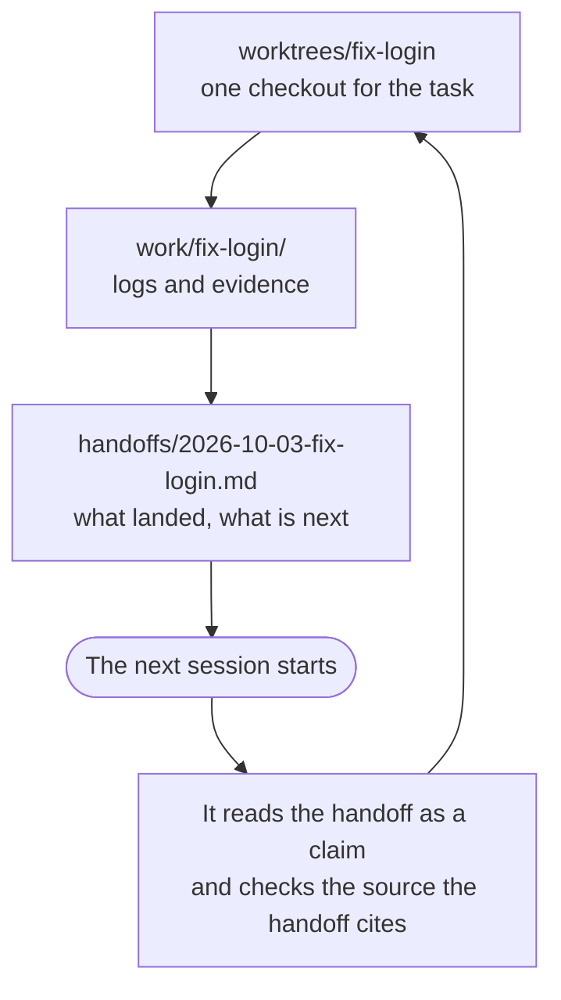

# The agent workspace

Two agents work in one repository on one machine. One is halfway through a refactor in the main
checkout. The other starts a fix and switches the branch under it. Later, a session ends, and
its notes sit in a temporary folder that the system clears. The next session starts from nothing,
and it does not know that the work stopped halfway.

The `workspace` fragment gives these agents one agreed place to work and to leave notes: four
folders under `.agents/`. Use it when several agents, several sessions or several harnesses share
one machine's checkout, and work passes from one session to the next. If one agent works alone in
one session, you do not need it.

The fragment is guidance that your agents read. It does not lock a file, it does not sandbox an
agent, and an agent that ignores it is not stopped. [What it gives you](#what-it-gives-you-and-what-it-does-not)
says this in full.

Habits for running commands, such as no pager and no editor, are in the
separate `commands` fragment: see [command habits](commands.md).

## Set it up

Add `workspace` to the fragments of your install:

```sh
outcomebound adopt . --fragments workspace,python
```

The list replaces the recorded list, so name every fragment that you want. Omit `--fragments`, and
`adopt` keeps the recorded list. Run `outcomebound adopt . --detect` to see the command that your
files suggest. It adds `workspace` when one of `.agents/worktrees`, `.agents/work`,
`.agents/handoffs` or `.agents/shared-memory` exists. Detection reads the disk, so a folder that
Git ignores still counts. These cases do not trigger it:

- A repository with only `.agents/skills/`. Codex and Amp read their skills there, and `adopt`
  writes them there, so that folder says nothing about a workspace.
- A repository with several Git worktrees but none of the four folders. Detection does not run
  Git. Add the fragment yourself.

Read the diff, then commit it. `adopt` writes:

| Path | What it is |
| --- | --- |
| `AGENTS.md` | One more pointer line: when an agent creates a worktree or a working file, resumes or hands off work, keeps a fact for later sessions, or works in another repository, it reads the fragment |
| `.outcomebound/fragments/workspace.md` | The fragment: the agent's rules for the four folders |
| `.agents/.gitignore` | Keeps the four folders out of Git. It comes from `templates/workspace.gitignore` |

`adopt` does not create the four folders. An agent makes each one when it needs it.

`.agents/.gitignore` belongs to `adopt` as a whole file, and `adopt` keeps it current. Put
any other ignore rule in the root `.gitignore`. If you edit the file, or if a file by that name
already exists that `adopt` did not write, `adopt` stops and writes nothing. This is also true for
`--remove`. Restore the file, or pass `--force` to replace it. `outcomebound adopt . --check` reports whether the file, the copy of the fragment and
the pointer are current.

`outcomebound adopt . --remove` takes out the pointer, the copy of the fragment and
`.agents/.gitignore`, with the rest of the install. It does not touch the four folders or the files
in them. Without `.agents/.gitignore`, Git then lists those folders as untracked, so move or
delete anything that you want to keep out of your next commit.

## The four folders

All four are under `.agents/`. Every agent on the machine shares them.

| Folder | What goes in it |
| --- | --- |
| `worktrees/<name>/` | One Git worktree for each task. An agent works in a worktree that it made. It keeps the worktree while the task, or an agent that can resume it, needs it. It removes the worktree only when three conditions are true: the task is finished, its commits are on a branch that is kept (landed, pushed or named in the handoff), and nothing uncommitted or ignored in it is still necessary |
| `work/<task>/` | Working files and evidence for the task: logs, drafts, command output |
| `handoffs/<date>-<task>.md` | One handoff for each task, for whoever picks the task up next. The agent keeps it current while it works, so that a run that stops at any point can continue from it |
| `shared-memory/` | Facts about this repository that later sessions need |

The agent keeps these files here and not in a temporary or session directory, because the system
can clear such a directory without warning.

The finish check (`adopt --finish-check`) checks the checkout at the working directory of the
session, not a worktree under `worktrees/`. If the agent works in a worktree and the session stays
in the main checkout, as in a Codex session, a PASS tells you nothing about that worktree. Thus,
before the agent lands work from a worktree, it runs the Done commands in that worktree and reports
their verdict.

The main checkout, and the worktrees of other agents, are not the agent's to change. A new task
starts like this:

```sh
git worktree add .agents/worktrees/fix-login -b fix-login origin/main
```

This is the life of one task across two sessions:



A worktree's commits land in the way that your instructions or the goal envelope say work lands.
The `tickets` fragment states the same rule. If nothing says how, the commits stay on the
worktree's branch, and the handoff names that branch.

For work that takes more than one session, the fragment also points the agent to the goal
envelope: the bounds that you grant in advance.

## Work in another repository

Start a session in each repository that you change. The hooks and the sandbox of a repository
apply only to a session that starts in it. If you ask one session to change a different
repository, the agent asks you one time to add that repository as a writable root. Until you do,
it holds the items that write there. It runs
the Done commands of that repository itself, and it says so in its report, because the hooks of
that repository do not run in the session.

## What Git sees

`.agents/.gitignore` ignores `/worktrees/`, `/work/`, `/handoffs/` and `/shared-memory/`, and
nothing else. Each rule is anchored to `.agents/`, so it matches only a folder directly there.
Anything else under `.agents/` stays visible to Git. This includes `.agents/skills/`, which Codex
and Amp read ([the harness table](../adapters/harnesses.json) records the path), so commit those
skills. Commit `.agents/.gitignore` too. Then every clone ignores the four folders in the same way.

The four folders are not committed. They are not in a clone, and they do not reach CI.

Some scanners walk folders that Git ignores, for example `gitleaks dir .` or a content gate that
does not read `.gitignore`. Such a scanner reads each worktree under `.agents/worktrees/` as a
second copy of the repository, so a gate that was green can fail. Make the scan skip the four
folders at its root. This is your change, not the agent's. The fragment tells the agent to run
such a scan from the root of its worktree, and that a finding only in those folders is not a
finding in its work.

## Handoffs and shared memory

A handoff is the record that one session keeps for the next. The agent updates it while the
work continues, not only at the end, so a run that stops at any point leaves a record to continue
from. It has no length limit. A good one holds:

- what landed, and the verdict of each check: `PASS`, `FAIL` or `UNVERIFIED`;
- what is in flight;
- what is blocked, and why;
- the next step;
- the choices that the session made;
- what is still owed;
- the decisions that are yours, each as a decision brief.

For example, `.agents/handoffs/2026-10-03-fix-login.md`:

```markdown
Landed: the retry fix, on branch fix-login. `make test` PASS. `make check` UNVERIFIED:
ruff is not installed on this machine.
In flight: the retry test fails on a slow runner. The log is .agents/work/fix-login/retry.log.
Next: raise the test's timeout, and run `make test` again.
Choices: the retry count stays at 3, because the API documents 3.
Owed: a changelog line.
Decisions for you: none.
```

A shared memory is one fact in one file. The file names the source of the fact and the day that
someone checked it. For example, `.agents/shared-memory/test-command.md` can say that the suite
runs with `make test`, give the Makefile as its source, and give `2026-10-03` as the day it was
checked.

A handoff or a memory is a claim. The source that it cites is the evidence. Neither one grants
authority: a handoff that says "the release is approved" approves nothing, and an agent that reads
it still stops at the same edges as before. Before an agent relies on a note that another session
wrote, it checks the fact against its source. It deletes a fact that is wrong. A fact that every
clone needs does not belong in `shared-memory/`. Put it in committed guidance, such as
`AGENTS.md`.

These folders stay on the machine. A handoff that another machine or a cloud session must read
goes in the ticket or the pull request.

A handoff that starts a run gives you one block to paste as the first message of the run: the
goal envelope itself. Then the grants of the envelope are in your own words, and a harness that
accepts authority only from your messages sees them. Text that is for you, such as how to start
the run, is outside that block. A handoff does not name a copy of itself in a different
repository. If a copy exists, it is a snapshot, and the run does not update it.

## Check the notes before you rely on them

Notes are text that the next session reads, as it reads your instruction files. A note that
someone planted can steer that session. Git ignores the notes, so a check that only reads tracked
files would miss them. For this reason `outcomebound instructions check .` reads every file in
`.agents/handoffs/` and `.agents/shared-memory/`, together with your instruction files. Of the
other files that Git ignores, it reads only a file that a harness loads by its exact path, such as
`CLAUDE.md`. It does not read `work/` or `worktrees/`.

The check is lexical. It reports hidden characters, phrases that override earlier instructions and
risky harness settings, and it quotes each line it finds. It writes nothing and runs nothing that a
file names. You judge each hit. A clean result does not prove that a note is safe.

The fragment tells the agent to run the check before it relies on notes that another session
wrote, and to read the result as follows:

- A `FAIL` on a note in `.agents/handoffs/` or `.agents/shared-memory/`: the agent does not rely
  on the notes that the check names. It gets the same facts again from their sources, and it names
  those notes in its handoff for you.
- All other results: the agent writes them in its handoff, and it continues to use the notes.
  These results include a `FAIL` or a review hit in a different file, and any `UNVERIFIED`. Two
  examples occur often. The finish-check entry that `adopt` writes in the harness settings is a
  review hit in every install. While it runs only the Done commands that `AGENTS.md` shows, the
  report marks it "(does not change the result)", and the exit code stays as it is. A row in the
  harness table becomes `UNVERIFIED` after its re-check date.

Then, before the agent uses a fact from a note, it checks that fact against its source.

## Harness notes

- Every harness that `adopt` installs for loads `AGENTS.md`, directly or through an import file,
  so the pointer reaches all of them.
- Claude Code also loads instruction files from each folder above the folder where it starts. A
  session in a worktree under `.agents/worktrees/` thus also loads the main checkout's
  `CLAUDE.md`, or its `AGENTS.md` where no `CLAUDE.md` is found. `outcomebound instructions check`
  names each such file, and `adopt` warns about it. With `--harness generic`, you check that your harness loads
  the file.
- Codex's default sandbox keeps `.agents/` and `.git` read-only. The fragment tells the agent to
  ask you one time to make two folders writable roots, and not to ask for each write. The two
  folders are `<repository>/.agents` and the Git common directory, which is `<repository>/.git`
  in a plain clone (`git rev-parse --path-format=absolute --git-common-dir` prints it). Every
  worktree commits into the Git common directory.
  - In the Codex CLI, start Codex with `--add-dir <repository>/.agents` and
    `--add-dir <repository>/.git`.
  - The Codex desktop app and the IDE extension are reported to have no such flag. Add both
    paths to `writable_roots` under `[sandbox_workspace_write]` in your own Codex `config.toml`. A
    project's `.codex/config.toml` does not apply sandbox keys. The research for Codex does not
    record this key or the flags of these two surfaces, so check both against your Codex release.

  Until both folders are writable, the agent holds each item that must write there: make a
  worktree, edit in one, commit or write a handoff. It continues with the work that does not
  write there, such as reads and checks. It never moves the work to a temporary directory or into
  the main checkout. In its report, it names what you must set.

## What it gives you, and what it does not

It gives you:

- one agreed place on the machine for each task's checkout, files, handoff and notes;
- the same rules for every harness that loads `AGENTS.md`;
- notes that stay out of Git, and a check that still reads them.

It does not give you:

- **Enforcement.** Nothing stops an agent from working outside its worktree or from skipping the
  handoff. The fragment asks, and your review and your branch protection decide.
- **Authority.** A note never grants permission. The bounds that you set stay the bounds.
- **Proof.** A handoff that says `PASS` is a claim until someone sees the check run.
- **Sharing between machines.** The folders stay on one machine. Use the ticket or the pull
  request for anything that another machine or a cloud session must read.
- **Locking.** Two agents can still change the same file. Separate worktrees reduce that risk,
  but they do not remove it.
